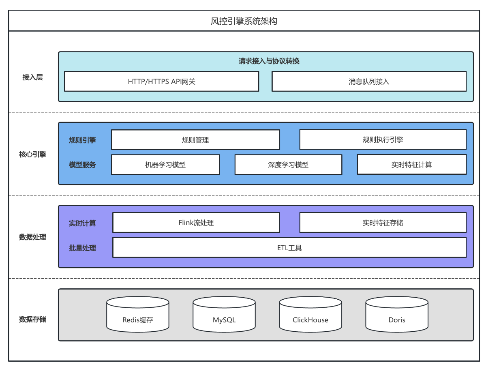
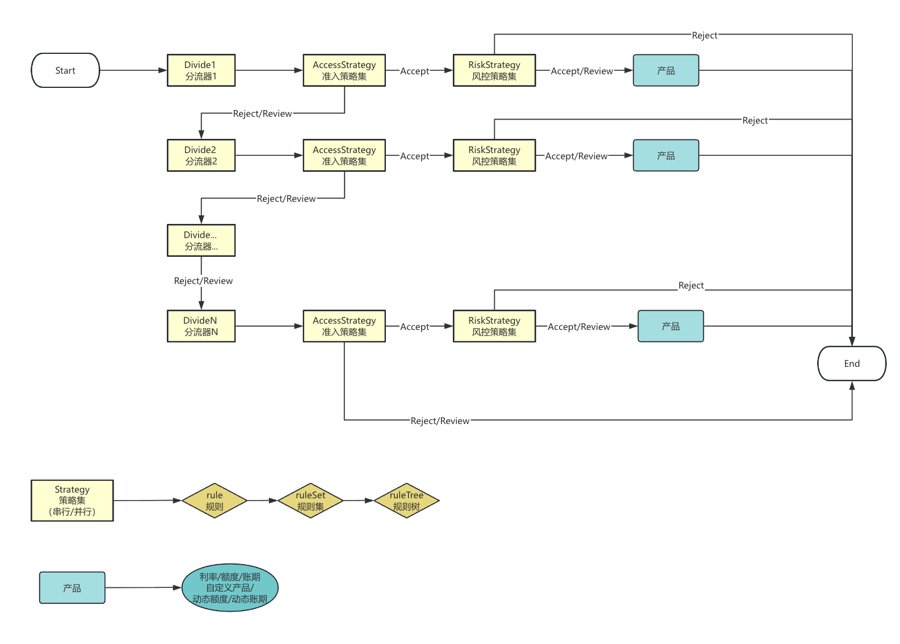

`vRule` 是一款基于 `Java` 的智能风控规则决策引擎，提供多种数据源、规则、规则集、规则树、策略集、分流器、产品管理等规则管理工具，可以快速开发各种自定义场景的智能决策。

其创新性地采用“分层”概念，将业务线、场景、分流器、策略集、规则、产品、数据源规划为不同的层级，通过前后之间的依赖关系，更为清晰的展示场景下策略的配置运行情况。

#### 功能特性
 - 基础能力
   - 业务线管理
   - 场景管理
   - 冠军挑战者管理
   - 后台用户管理
   - 业务线权限管理
   - 用户操作管理
 - 规则配置
   - 规则
   - 规则集
   - 规则树
   - 策略集
   - 分流器
 - 产品
   - 额度
   - 利率
   - 账期
   - 自定义
   - 动态额度
   - 动态账期
 - 集成扩展
   - 决策集
   - 评分卡
   - `Python` 代码
   - 标准 `HTTP` 接口接入
   - 特殊 `HTTP` 接口接入
   - 模型自动化部署并接入
   - 标签插件
   - 自动入黑
   - 白名单列表
   - 流程标记
 - 发布监控
   - 发布 `DIFF`
   - 一键发布/回滚
   - 流量重放
   - 自动化测试
 - 指标分析
   - 场景级指标监控
   - 关键特征指标监控
   - 流量重放指标观测
   - DAG
   - 用户请求可视化
   - 日/周/月分析报告
 - 附加
   - 专属技术支持
   - 专属模型、特征开发

#### 架构图

#### 场景运行流程图

#### 名词释义
1. `Accept/Review/Reject` 
根据其英文含义可知，`Accept` 表示通过、`Reject` 表示拒绝、`Review` 表示人审/机审。

2. 串行/并行 
字如其意，即规则在运行过程中【依次顺序】还是【同时】计算规则结果得到最终策略集的结果。

3. 准入策略集/风控策略集 
该两者在实现及配置上并无区别，只是其在分流器内担任的角色不同，准入策略集用于判断是否进入该分流器，进而触发风控策略集，来为用户展示其最终可见的产品。

4. 产品 
`vRule` 中将额度、利率、账期、自定义、动态额度、动态账期统一称为产品，非印象中产品概念。

#### 基础功能
1. 后台页面偏好自定义设置

2. 全局菜单搜索

3. 水印

4. 白日/夜间模式

5. 中英文切换

6. 时区设置

7. 消息通知

8. 个人信息页

#### 作者
[vgbhfive](https://blog.vgbhfive.com)

vgbhfive@foxmail.com
