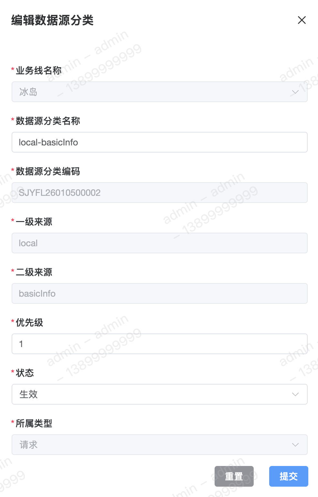

数据源分类是对数据的来源进行管理，通过对【不同渠道】、【不同数据接口】、【不同所属类型】的划分来规范化管理数据源。

#### 字段含义
1. 一级来源 
一级来源可用于表示不同数据来源的【渠道】。

2. 二级来源 
二级来源可用于表示同一渠道下不同的【数据接口】。

3. 所属类型 
所属类型用于明确该所属类型的大致划分，所属类型在数据源分类新增时确定后，后续将无法再次修改。 
目前共支持以下几种：
	 - 请求
	 - `Python`
	 - `HTTP`
	 - 自定义 `HTTP`
	 - 决策集
	 - 评分卡

#### 列表

#### 新增
新增所属分类为【请求】的数据源分类。 

#### 修改
修改数据源分类时，其【所属类型】不可修改。 

#### 详情

