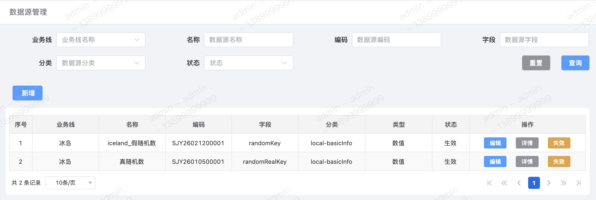
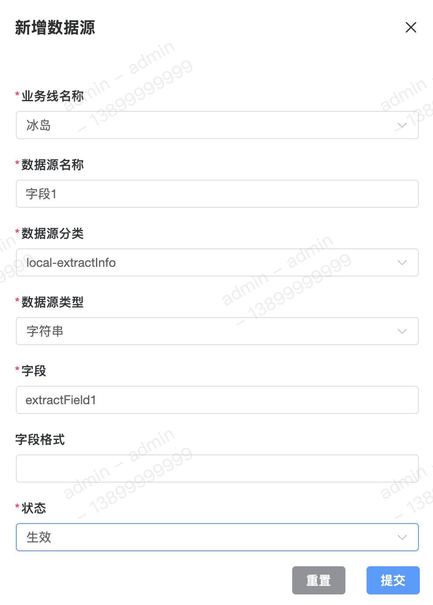
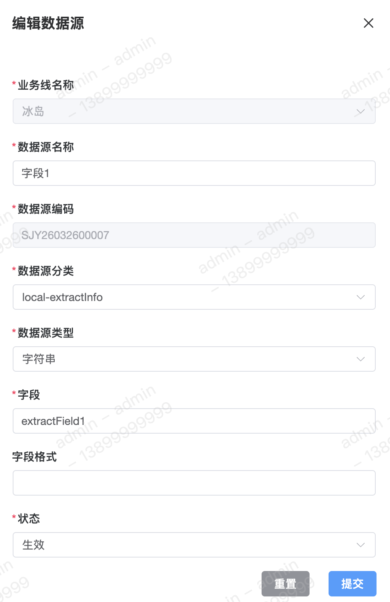
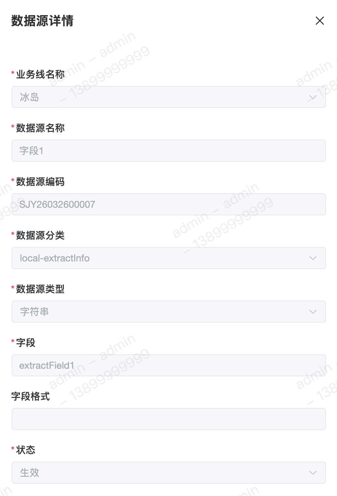

数据源用于表示单个【特征】的相关信息，其包含所属数据源分类、字段、类型、名称、编码等概念。

#### 字段含义
1. 字段 
顾名思义用于表示特征字段。

2. 分类 
【数据源分类】概念为 `vRule` 独创概念，用于封装特征的不同来源。常见的包含 `local` 请求体、`HTTP` 接口、`Python` 脚本，还有很多其余类型，详情请见【数据源分类】。

3. 类型 
`vRule` 通过对基础类型的二次封装，避免出现精度丢失、规则处理异常等问题，覆盖主流常见数据类型。目前支持以下几种类型：
	 - 数值（`Integer`、`Float`、`Double`、`Long`、`Boolean`）
	 - 字符串（`String`、`Char`）
	 - 列表（`List`）
	 - 时间（`Date`、	`Time`、`DateTime`）
	 - `JSON`

#### 数据源函数
数据源函数用于对获取到的特征进行二次加工，根据不同的数据类型，目前可支持以下操作：
 - 数值
 	- 加法
 	- 减法
 - 字符串
 	- 截取
 	- 长度
 - 列表
 	- 截取
 - 时间
 	- 年
 	- 月
 	- 日
 	- 时
 	- 分
 	- 秒
 	- 转换
 - `JSON`
 	- 获取
 	- 添加

 > 目前该功能还在开发中，敬请期待。

#### 备注
1. 默认数据源 
在新增业务线成功后，会自动生成【真随机数】、【假随机数】、【`reqId`】 三个默认数据源。 
关于真随机数和假随机数的区别，真随机数在于同一用户请求引擎接口时【随机数各不相同】，而假随机数则是同一用户请求引擎接口时【随机数一直相同】。

#### 列表

#### 新增

#### 修改

#### 详情

