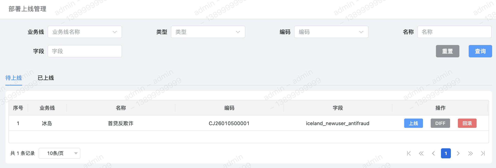
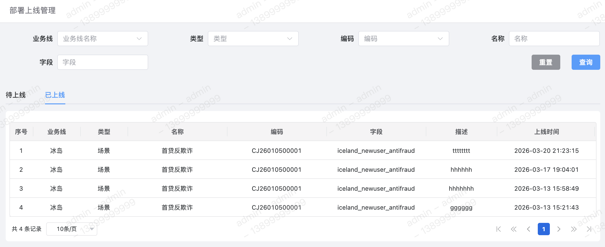
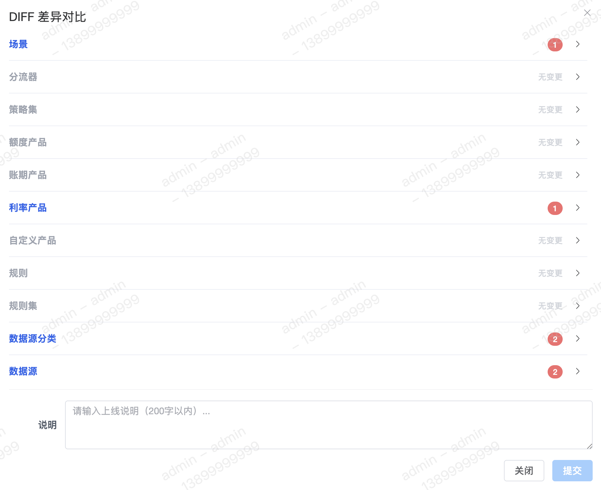
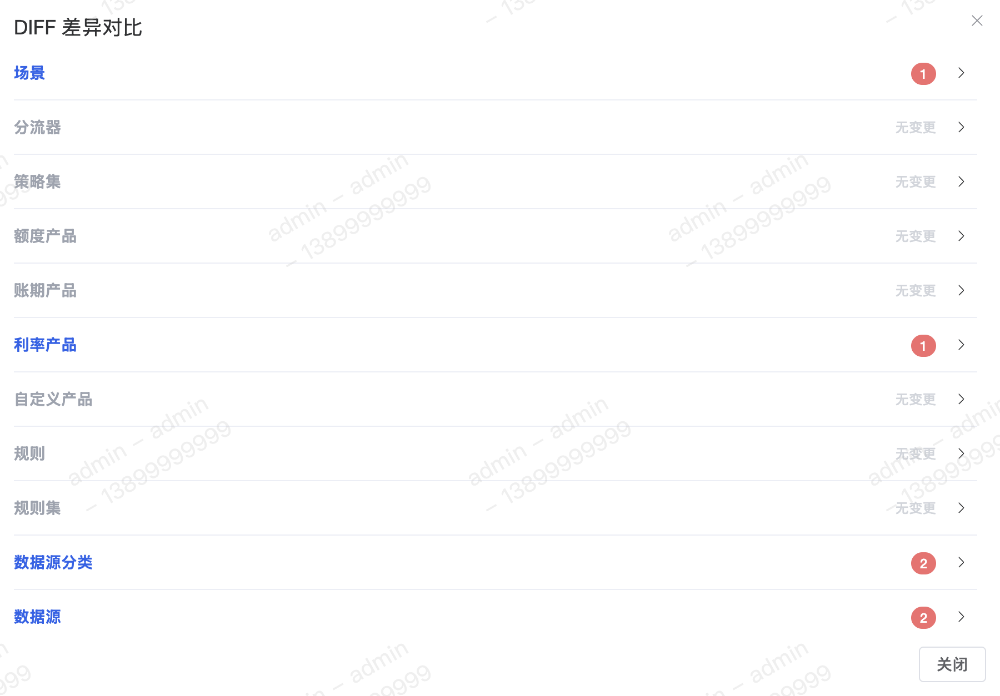

deploy

#### 字段含义
1. `DIFF`
展示场景当前版本与历史最后一次版本修改内容的【差异点】。差异点主要分为以下几点：
	 - 场景
	 - 分流器
	 - 策略集
	 - 额度产品
	 - 利率产品
	 - 账期产品
	 - 自定义产品
	 - 规则
	 - 规则集
	 - 数据源
	 - 数据源分类

#### 列表
待上线列表：

已上线列表：

#### 上线
上线场景时，需要确认当前上线与历史最后一次上线之间所有修改的【差异点】和填写本次【上线记录说明】。之后在版本回滚时可对照历史上线说明。

#### `DIFF`
仅查看本次场景上线与历史最后一次上线之间所有修改的【差异点】。

#### 回滚
