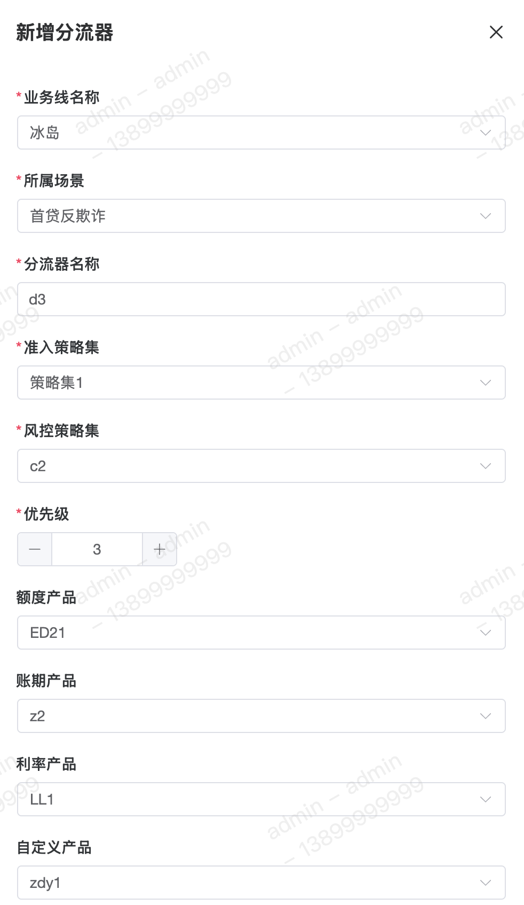
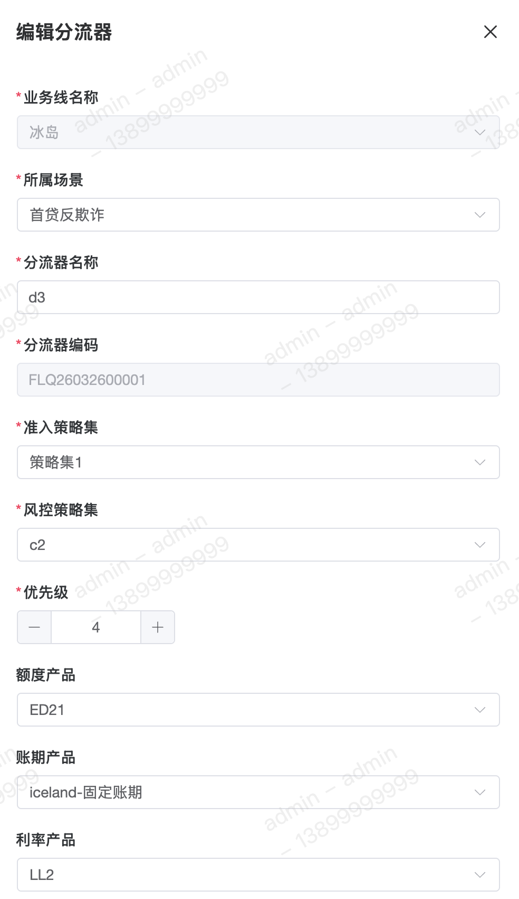
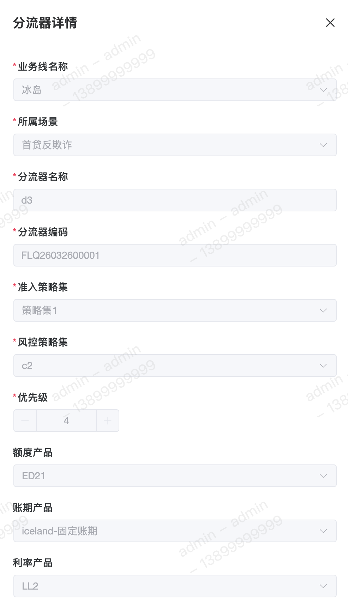

分流器，字如其名，其主要功能用于决策路由，通过划分【准入策略集】和【风控策略集】，即可在同一场景下可得到不同的风控结果。

#### 字段含义
1. 所属场景 
用于确定该分流器配置在哪个场景下，同时单个分流器【只能划分在一个场景下】，不能同时配置多个场景。

2. 准入策略集 
判断用户【是否进入该分流器】下执行后续的策略和获取对应的产品结果。

3. 风控策略集 
对用户进行策略筛选，给出最终的【引擎结果】和【产品结果】。

4. 优先级 
优先级表示该分流器在其所属场景下的执行顺序，优先级越【小】越优先执行。

#### 列表

#### 新增

#### 修改

#### 详情

