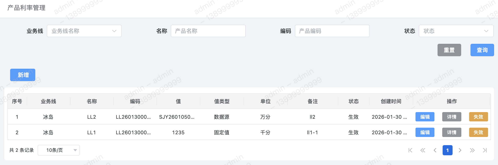
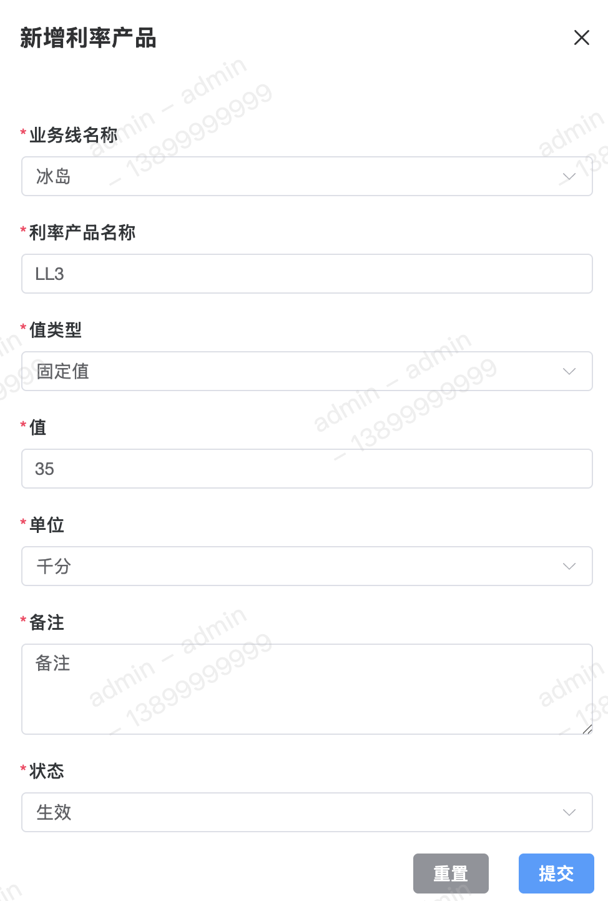
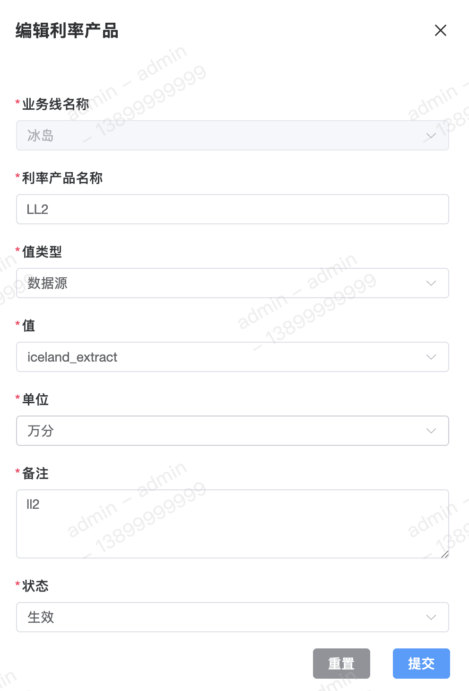
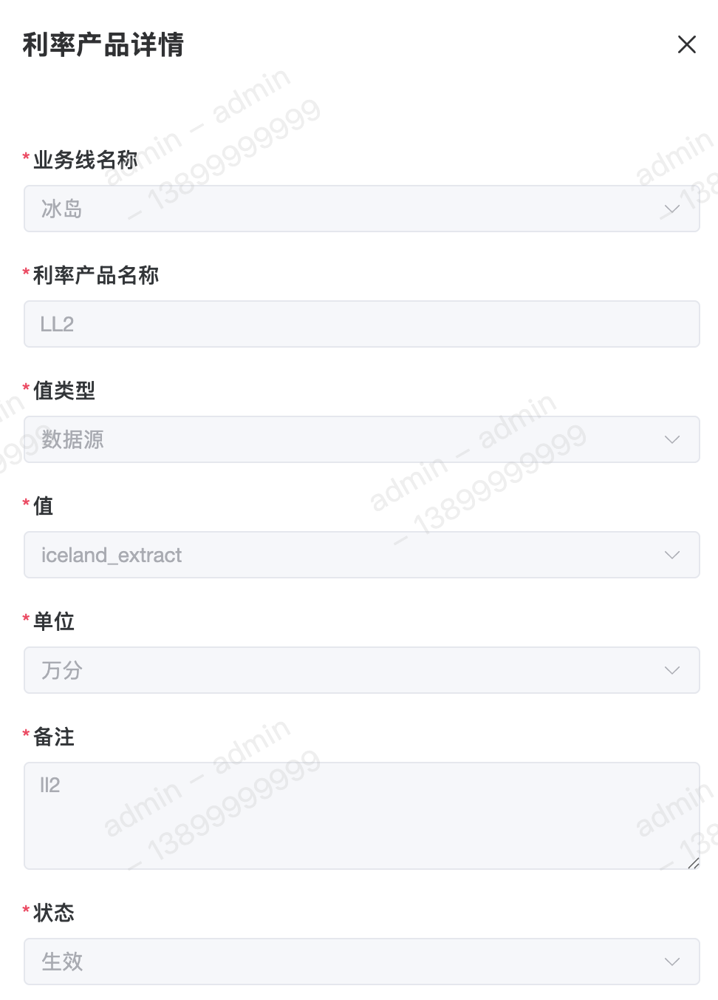

利率产品用于配置产品的利率，即用户最终借贷的利息成本。利率结果类型支持【固定值】或【数据源】，利率类型支持【百分位】、【千分位】或【万分位】。

#### 字段含义
1. 值 
值即利率产品的最终结果，其可配置为固定值或数据源。

2. 值类型 
利率值类型目前支持两种类型：
	 - 固定值
	 - 数据源

3. 单位 
利率单位目前共支持以下三种：
	 - 百分位
	 - 千分位
	 - 万分位

4. 备注 
添加利率产品的备注信息。

#### 列表

#### 新增

#### 修改

#### 详情

