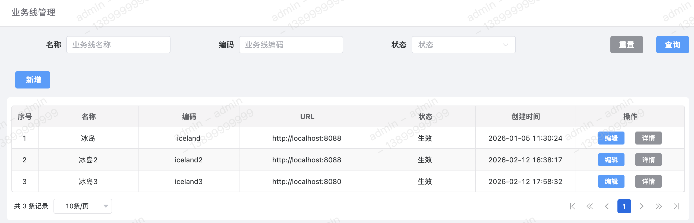
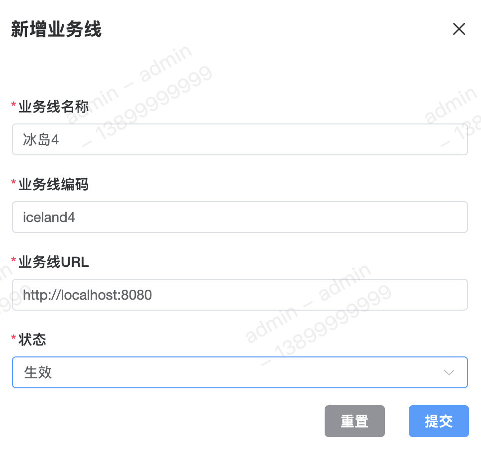
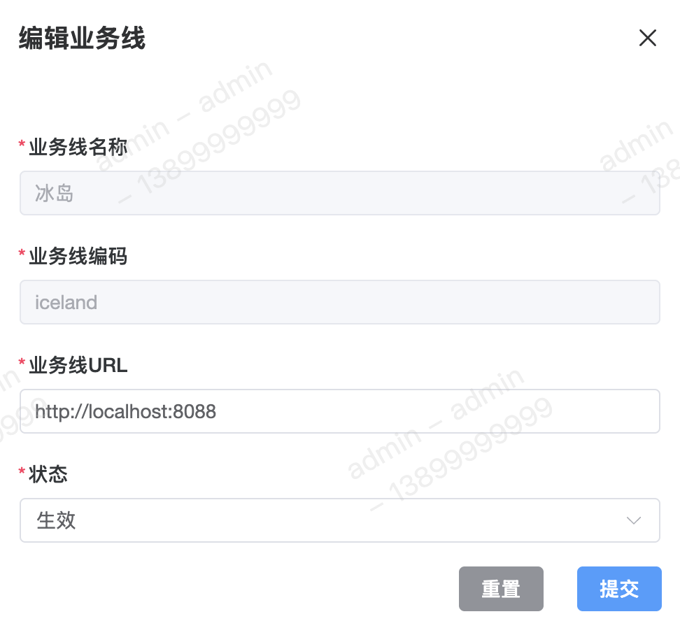
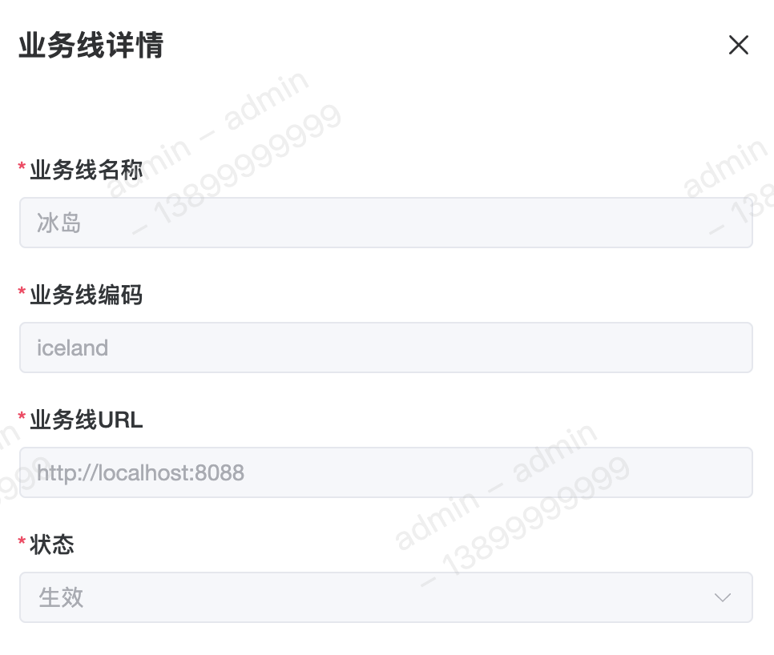

业务线管理主要用于新增/修改业务线相关的配置信息，其含义类似于【项目】、【国家】。其底层是通过不同后端数据库的访问权限来划分不同的业务线。

#### 字段含义
1. 编码 
该字段用于管理该业务线下全局相关配置信息的所属。

2. `URL` 
该字段用于配置该业务线引擎核心地址 `URL`。（相对于后端调用方的 `HTTP` 域名）

#### 列表

#### 新增

#### 修改
在修改操作中，已配置完成的业务线名称和业务线编码不可修改。 

#### 详情
