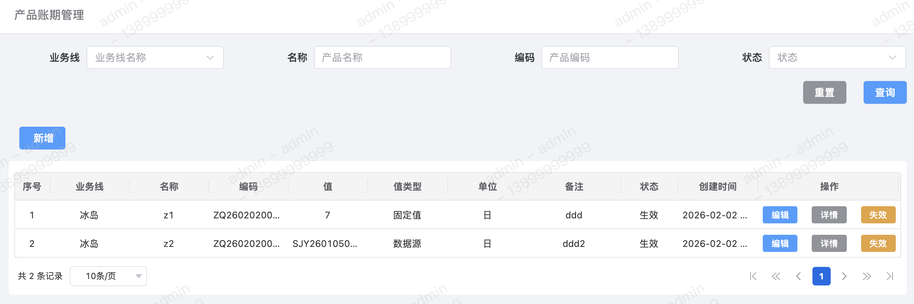
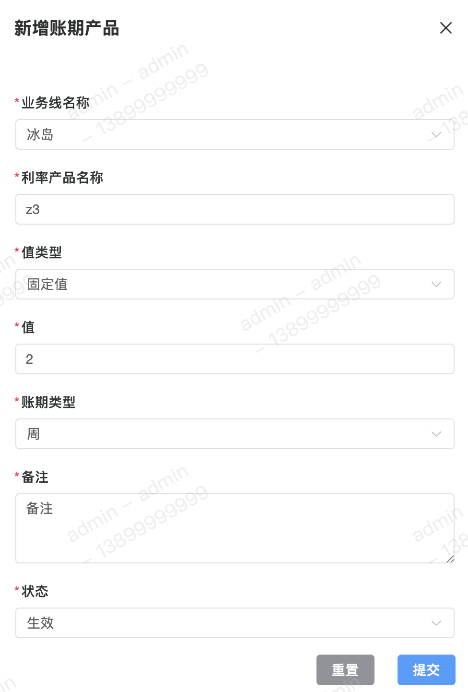

账期产品用于配置产品的账期，即用户最终借贷的还款期限。账期结果类型支持【固定值】或【数据源】，其账期类型支持【日】、【周】、【月】或【年】。

#### 字段含义
1. 值 
值即账期产品的最终结果，其可配置为固定值或数据源。

2. 值类型 
账期值类型目前支持两种类型：
	 - 固定值
	 - 数据源

3. 单位 
账期单位目前共支持以下四种单位：
	 - 日
	 - 周
	 - 月
	 - 年

4. 备注 
添加账期产品的备注信息。

#### 列表

#### 新增

#### 修改

#### 详情
