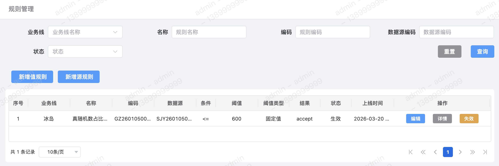
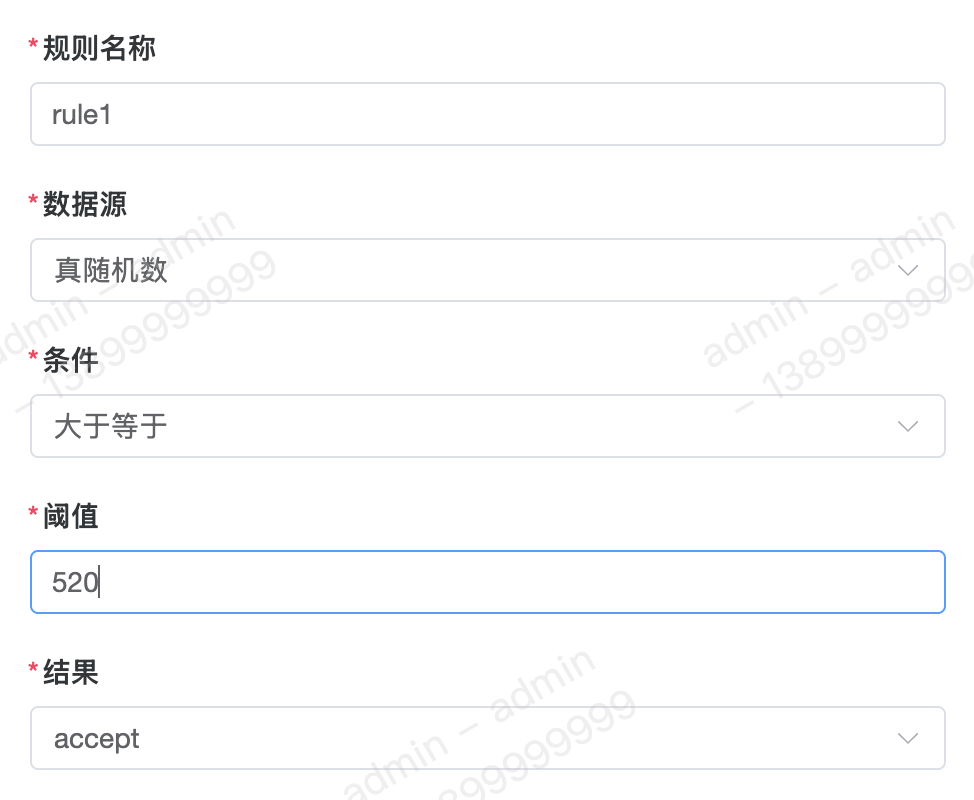
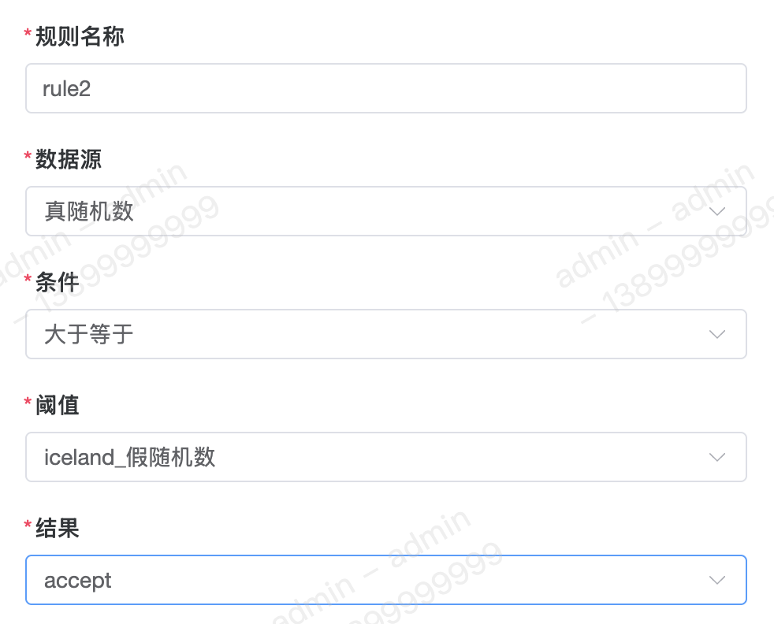
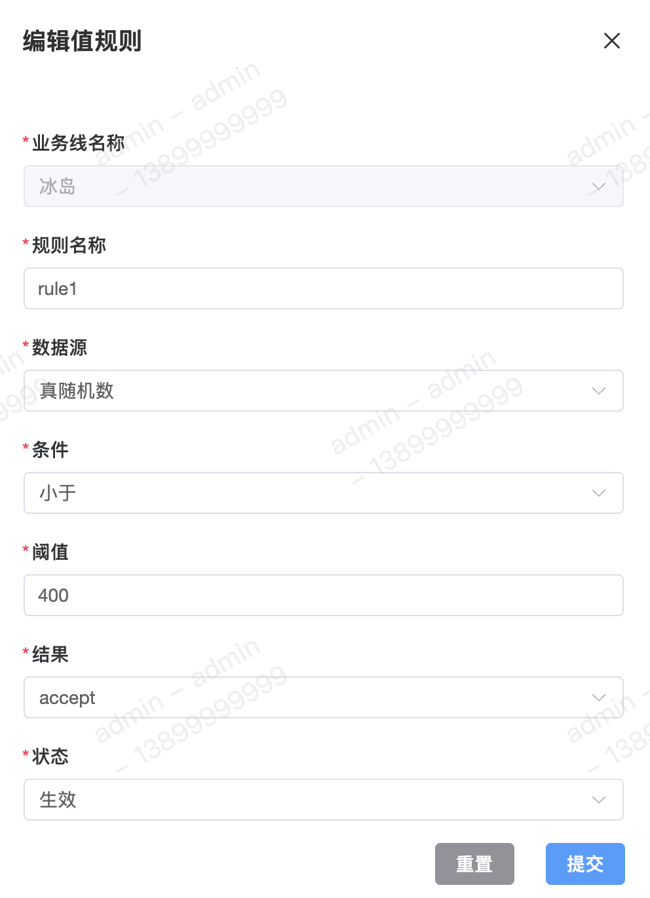
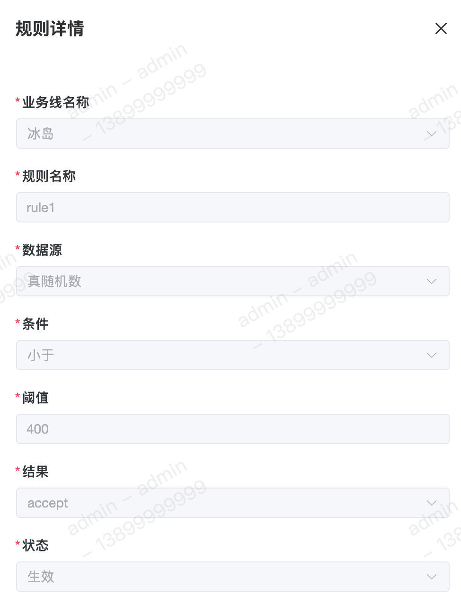

规则是决策引擎中最基本的逻辑单元。它通常由【条件】、【阈值】和【结果】三部分组成，遵循经典的 `If-Then` 逻辑。

#### 字段含义
1. 条件 
目前支持以下几种比较条件：
	 - 小于
	 - 小于等于
	 - 等于
	 - 大于
	 - 大于等于
	 - 不等于
	 - 范围
	 - `in`
	 - `not in`
	 - 包含
	 - 不包含
	 - 为空
	 - 不为空
	 - 空跑
	 - 打标
	 - 赋值
	 - 拉黑
	 - 加白

2. 阈值 
阈值可分为【固定值】和【数据源】，固定值与数据源的差异点在于规则的阈值都是动态可变。

3. 阈值类型 
阈值类型目前支持以下两种：
	 - 固定值
	 - 数据源

4. 结果 
规则结果目前支持以下三种：
	 - `Accept` 通过
	 - `Review` 人审/机审
	 - `Reject` 拒绝

5. 异常降级策略 
异常降级策略表示当在规则计算时遇到异常时的处理逻辑。目前支持以下三种：
	 - 不处理。
	 - 忽略异常通过 `Accept`。
	 - 忽略异常拒绝 `Reject`。

#### 列表

#### 新增
新增值比较规则 

新增源比较规则 

上述两种比较规则的差异点在于其配置的阈值是【固定值】还是【数据源】。

#### 修改

#### 详情

