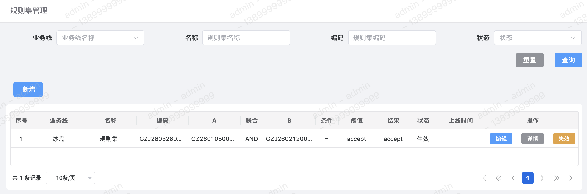
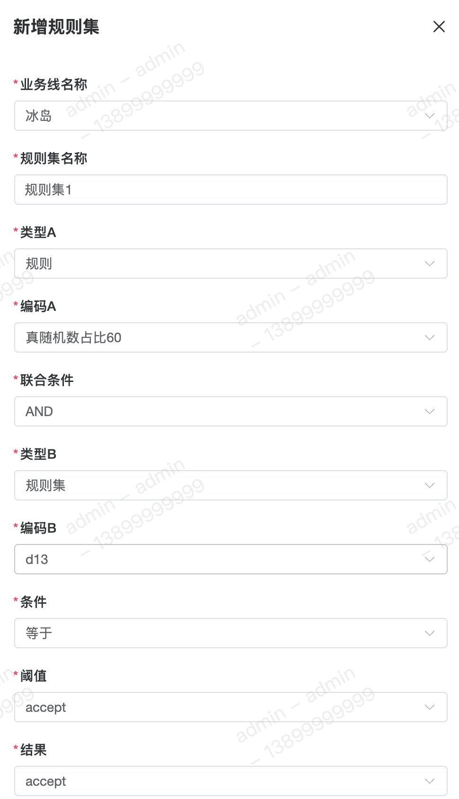
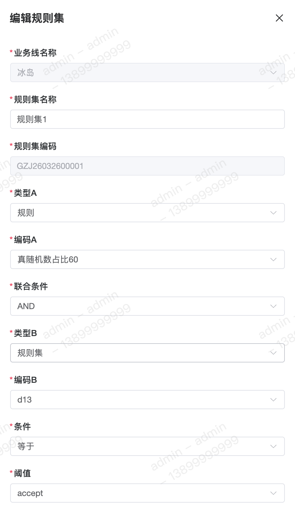
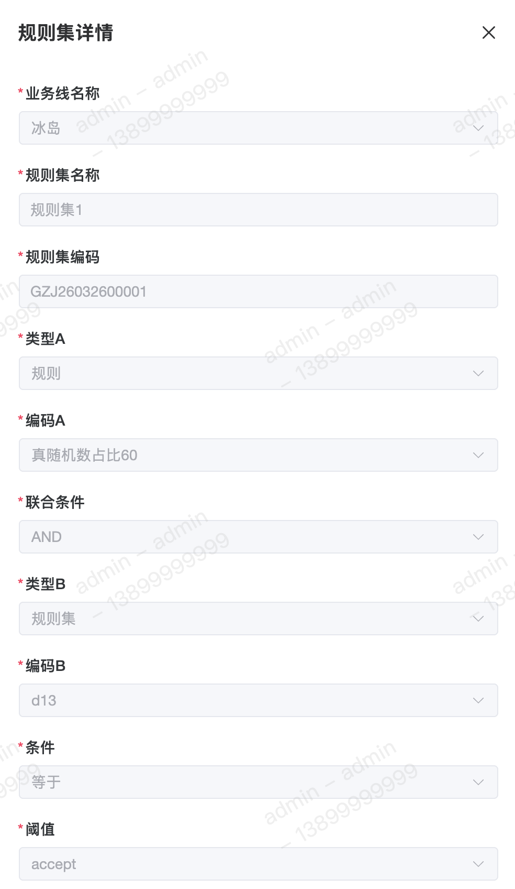

规则集是将多条具有逻辑相关性的【规则】、【规则集】打包在一起的集合。在实际业务中，单靠一条规则很难判定风险，需要多维度制定策略规则。

#### 字段含义
1. `A`、`B` 
其表示规则集中使用【规则】、【规则集】两两任选其二通过联合条件配置策略筛选。

2. 联合条件 
顾名思义，即将多个判断进行联合，目前仅支持以下两种：
	 - `AND` 表示【与】
	 - `OR` 表示【或】

3. 条件 
规则集的条件与规则的条件由于阈值的关系，其包含的条件很少，目前共支持以下几种：
	 - 等于
	 - 不等于
	 - `in`
	 - `not in`
	 - 空跑

4. 阈值 
该阈值表示 `A` 与 `B` 通过联合条件得到的结果与之比较。与结果字段一致，目前共支持以下三种：
	 - `Accept` 通过
	 - `Review` 人审/机审
	 - `Reject` 拒绝

5. 结果 
规则结果目前支持以下三种：
	 - `Accept` 通过
	 - `Review` 人审/机审
	 - `Reject` 拒绝

#### 列表

#### 新增

#### 修改

#### 详情

#### 示例
1. `A` 拒绝并且 `B` 拒绝时，最终结果才会拒绝，该如何配置？ 
	 - 联合条件：`OR`
	 - 阈值：`Reject`
	 - 结果：`Reject`