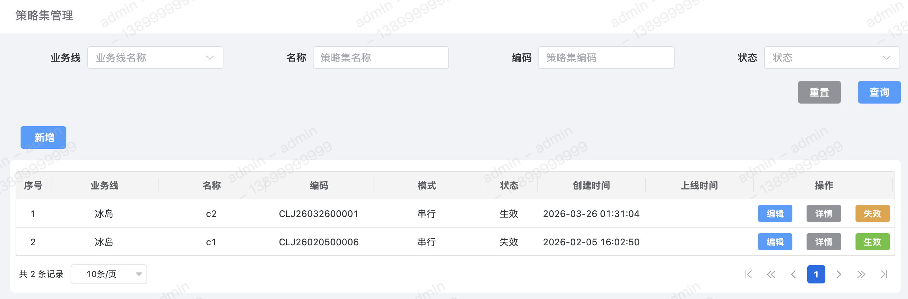
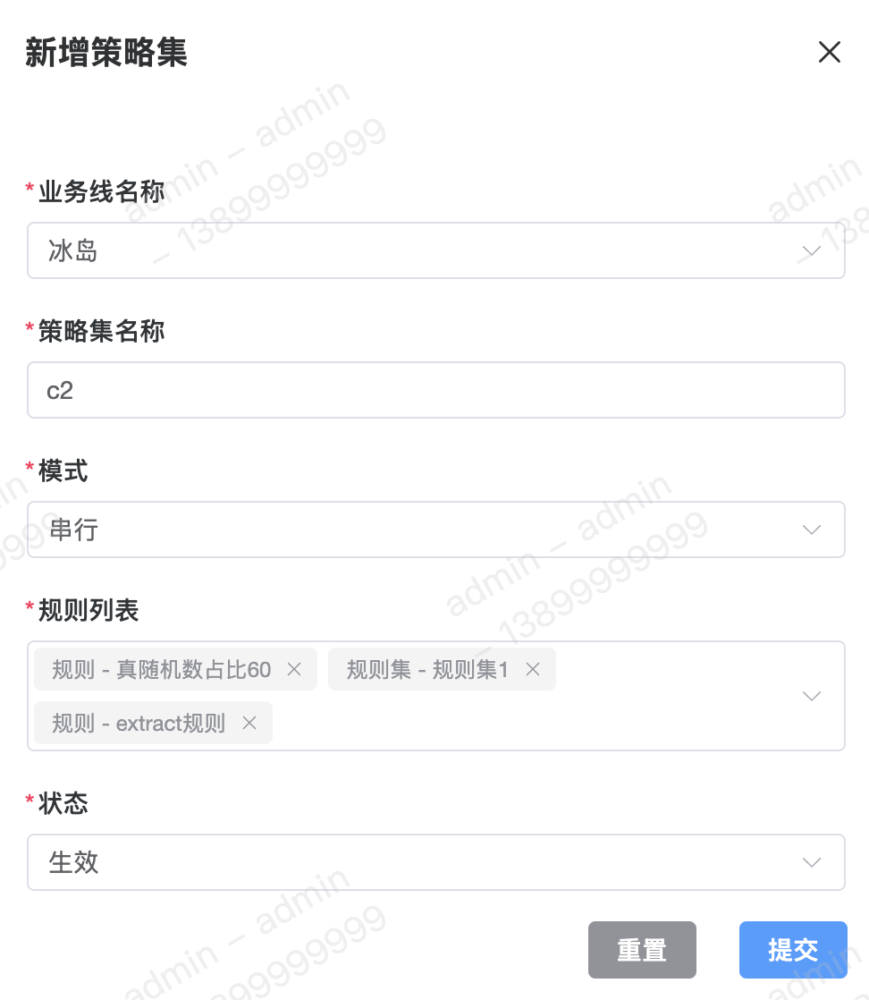
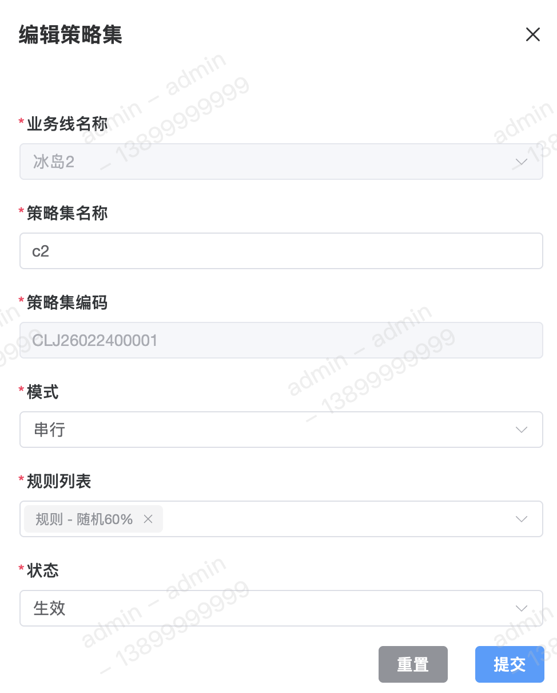
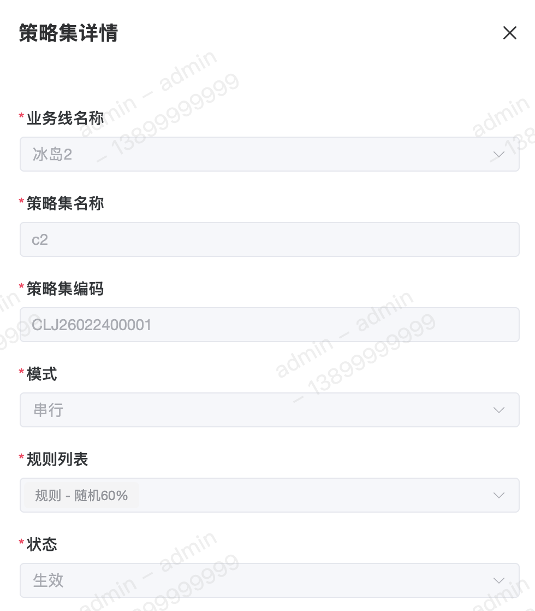

策略集，顾名思义即一系列策略（规则、规则集、规则树）进行逻辑组织和编排的结合体。

#### 字段含义
1. 模式 
模式目前共有两种：【串行】和【并行】。其差别在于规则的运行过程是【逐个顺序】执行还是【多个同时】执行。

2. 规则列表 
规则列表可用于【配置规则、规则集、规则树的执行顺序】，单个规则仅允许配置一次，不可重复。

#### 列表

#### 新增

#### 修改

#### 详情

