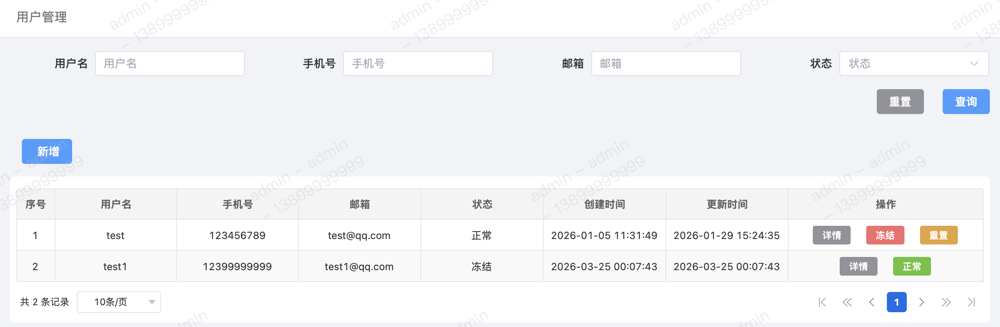
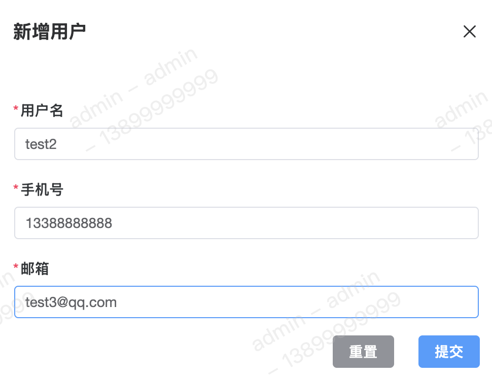

该页面用于管理可登录该系统后台的用户信息。

#### 列表

#### 新增
新增信息中的用户名、手机号、邮箱后续会被用作【页面水印】，用于防止信息泄露，因此在新增时尽量保证跟每个人员一一对应。 
新增用户成功后，用户需使用邮箱和【初始密码 `v_rule`】登录。 

#### 冻结
将正常状态的用户置为【冻结】状态，状态修改后即该用户不可登录该系统后台。

#### 重置
【重置用户密码】为初始密码 `v_rule`，后续该用户必须修改初始密码后才可继续登录。

#### 正常
将冻结状态的用户置为【正常】状态。
